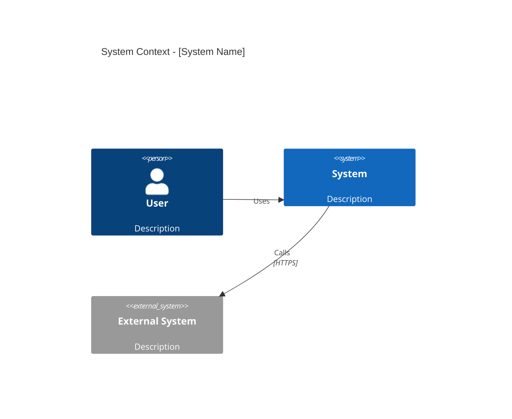
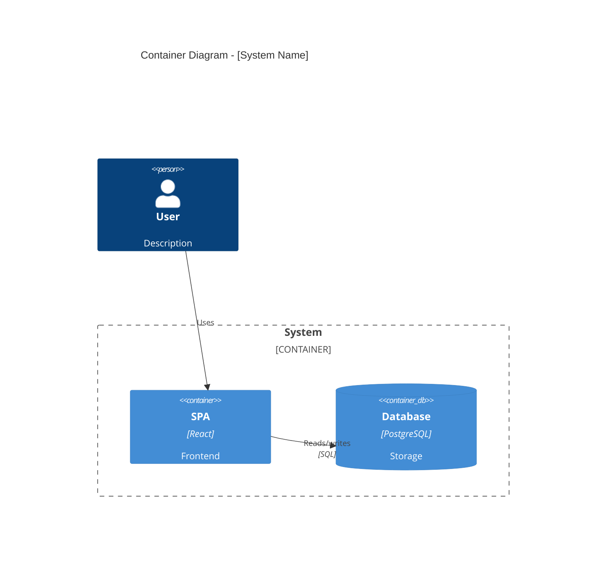

# oneticket-c4

Generate software architecture documentation using C4 model diagrams in Mermaid syntax.

`docs_path` is always provided in the prompt — never resolve it yourself.

---

## Output Location

Write to `<docs_path>/how/c4/` using this naming convention:

- `system-context.md` — System context diagram (C4Context)
- `containers.md` — Container diagram (C4Container)
- `components.md` — Component diagram (C4Component)
- `deployment.md` — Deployment diagram (C4Deployment)

---

## C4 Diagram Levels

| Level | Type | Audience | Shows | When |
|---|---|---|---|---|
| 1 | C4Context | Everyone | System + external actors | Always required |
| 2 | C4Container | Technical | Apps, databases, services | Always required |
| 3 | C4Component | Developers | Internal components | Only if adds value |
| 4 | C4Deployment | DevOps | Infrastructure nodes | Production systems |

Context + Container diagrams are sufficient for most teams.

---

## Diagram Syntax Examples

### System Context (Level 1)


### Container Diagram (Level 2)


---

## Element Syntax Reference

### People and Systems
```
Person(alias, "Label", "Description")
Person_Ext(alias, "Label", "Description")
System(alias, "Label", "Description")
System_Ext(alias, "Label", "Description")
SystemDb(alias, "Label", "Description")
```

### Containers
```
Container(alias, "Label", "Technology", "Description")
ContainerDb(alias, "Label", "Technology", "Description")
Container_Boundary(alias, "Label") { ... }
```

### Relationships
```
Rel(from, to, "Label")
Rel(from, to, "Label", "Technology")
BiRel(from, to, "Label")
```

---

## Best Practices

- Every element must have: name, type, technology (where applicable), description
- Use unidirectional arrows only
- Label arrows with action verbs ("Sends email using", "Reads from")
- Include technology labels ("JSON/HTTPS", "SQL")
- Stay under 20 elements per diagram — split complex systems
- Always include a title
- One diagram per file

---

## Rules

- Never overwrite an existing diagram — check before writing
- `docs_path` is always provided in the prompt — never resolve it yourself
- Architecture represents target vision, not only current state — label with `current`, `planned`, or `open` when needed
- Cross-references from `how/c4/` to `architecture.md` use relative path: `../architecture.md`
